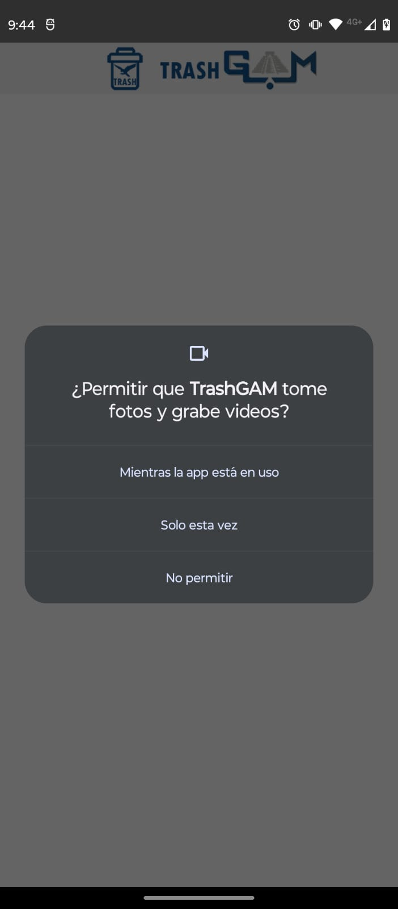
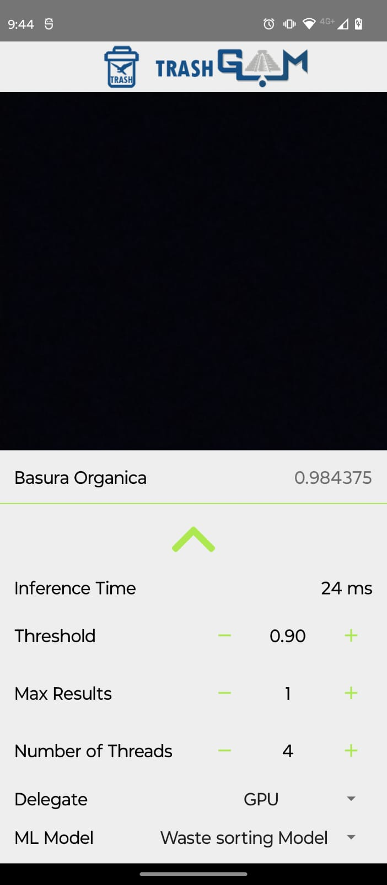
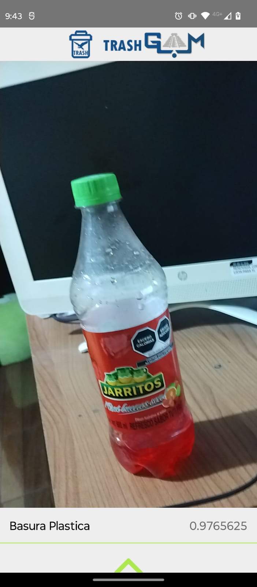
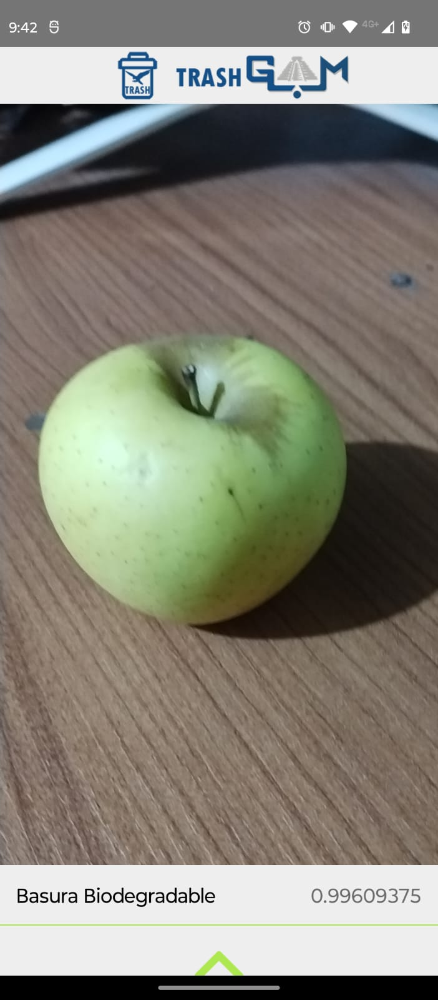
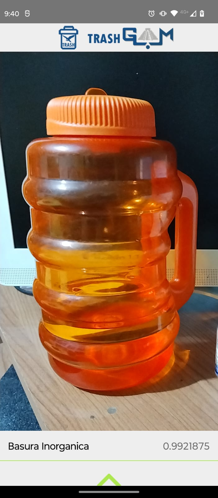

# Trash Gam

Diseñar e implementar un sistema inteligente que permita la correcta clasificación de los residuos sólidos depositados en los contenedores de basura ubicados en el exterior de las unidades académicas del Instituto Tecnológico de Gustavo A. Madero.

  

### Pre-requisitos 📋

Antes de comenzar a probar la aplicación, es necesario instalar las herramientas necesarias en nuestro dispositivo de computo. Sigue los siguientes pasos:

#### Paso 1:

Instalar Android Studio, el IDE oficial para el desarrollo móvil en la plataforma de Android.
Puedes descargar Android Studio desde la página oficial de <a href="https://developer.android.com/studio?hl=es-419&gclsrc=ds&gclsrc=ds">Android Studio</a>.
#### Paso 2:

Una vez instalado Android Studio, crea un emulador para previsualizar tu aplicación en acción. También puedes utilizar un dispositivo físico.

## Ejecutando las pruebas ⚙️

Pasos para iniciar la aplicación en tu dispositivo móvil:

1. Inicia la aplicación en tu dispositivo móvil.
2. Acepta los permisos de la cámara cuando se te solicite.

  

Pasos para configurar la aplicación y categorizar los residuos generados:

1. Realiza la configuración necesaria en la aplicación.
2. Categoriza los residuos generados según las opciones disponibles.

  

Pruebas de la aplicación después de la configuración:

1. Inicia las pruebas de la aplicación como se muestra a continuación:

  
  
  

## Construido con 🛠️

Las herramientas que se usaron para crear dicho proyecto fue:

* [Android Studio](https://developer.android.com/studio?hl=es-419&gclsrc=ds&gclsrc=ds) - El IDE utilizado
* [Teachable Machine](https://teachablemachine.withgoogle.com/) - Herramienta para generar nuestro modelo de Machine Learning compatible con TensorFlow Lite.

## Autores ✒️

* **Jonatan Morales** - *Estudiante de Ingenieria En Tecnologias De Informacion Y Comunicaciones* - [Jonatan Arturo Morales Tavera](https://www.linkedin.com/in/jonatan-arturo-morales-tavera-3b825b240/)

## Licencia 📄

Este proyecto está bajo la Licencia (Tu Licencia) - mira el archivo [LICENSE.md](LICENSE.md) para detalles

## Expresiones de Gratitud 🎁

* Comenta a otros sobre este proyecto 📢